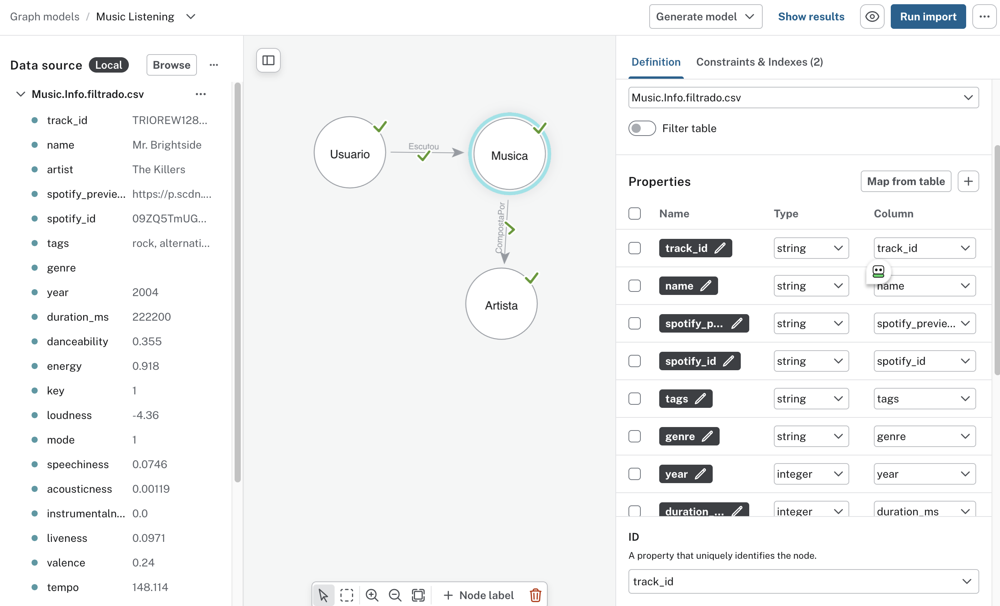

# neo4j_music_recommendations

[Repositório](https://github.com/kalkehcoisa/neo4j_music_recommendations)

# Dados utilizados
Os dados originais forma pegos no Kaggle. O dataset de nome [Million Song Dataset + Spotify + Last.fm](https://www.kaggle.com/datasets/undefinenull/million-song-dataset-spotify-lastfm).
Como ele é muito grande, passa e muito dos limites do Neo4j Aura de 200mil nós, foi feita uma filtragem - usando [este script python](dataset/filter_music.py) - mantendo somente as músicas ouvidas mais de 15 vezes por um usuário e eliminadas as músicas que ficaram sem nenhum ouvinte. Com isso conseguimos derrubar para 127.428 nós. O que nos permite ter espaço para trabalhar.

O dataset já filtrado e pronto se encontra no github releases aqui:
* [Dataset](https://github.com/kalkehcoisa/neo4j_music_recommendations/releases/tag/data)
* [User.Listening.History.filtrado.csv](https://github.com/kalkehcoisa/neo4j_music_recommendations/releases/download/data/User.Listening.History.filtrado.csv)
* [Music.Info.filtrado.csv](https://github.com/kalkehcoisa/neo4j_music_recommendations/releases/download/data/Music.Info.filtrado.csv)

# Modelagem
A importação dos dados foi feita na interface do Neo4j Aura utilizando os arquivos filtrados acima. Mapeados da seguinte forma:

Os gêneros músicais/tags estão numa string separada por vírgulas chamada tags. Temos também o genre, que é uma string com o gênero predominante da música. O import do Aura não permite fazer esse tipo de manipulação, o que vamos fazer com o script [setup.cypher](setup.cypher).

